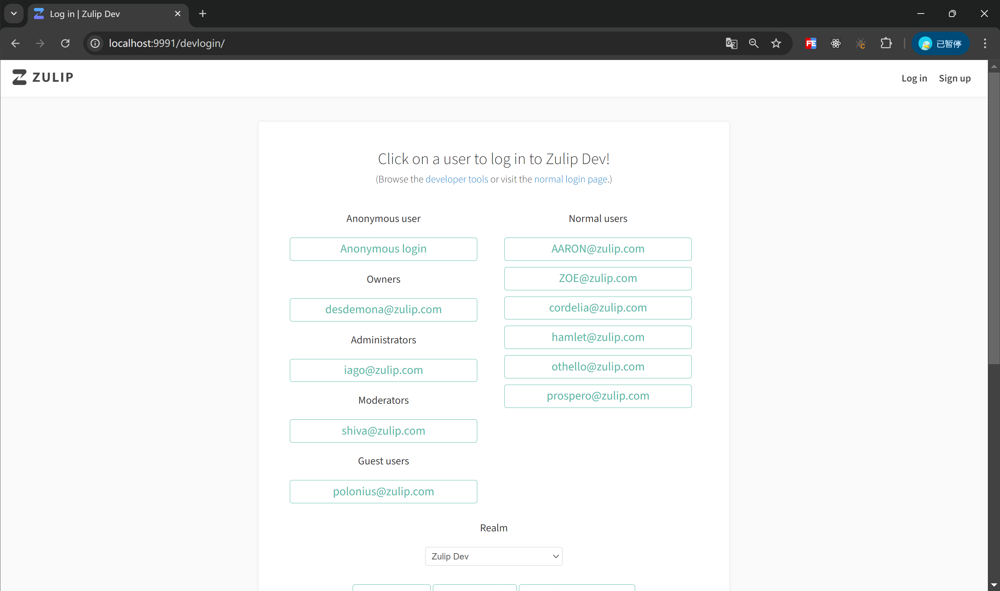
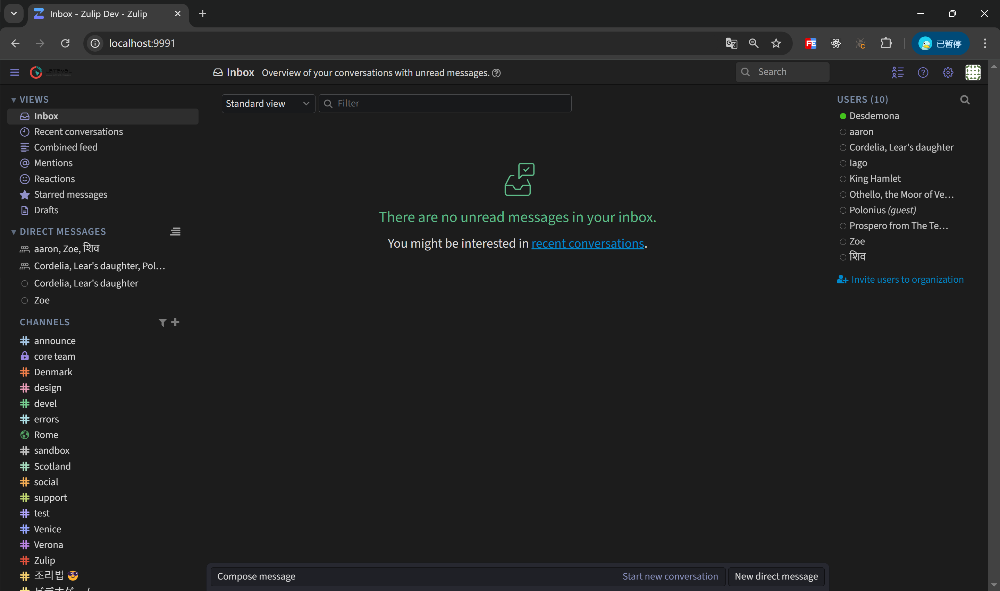
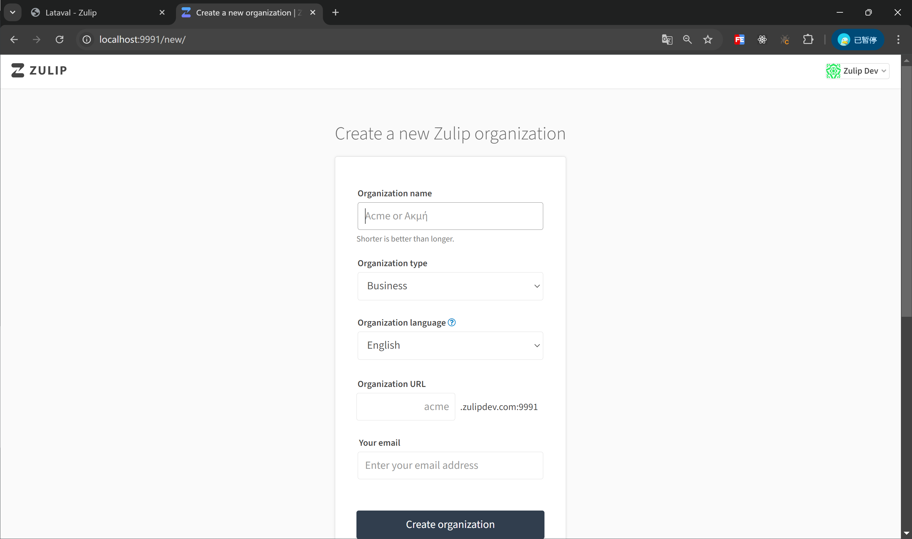
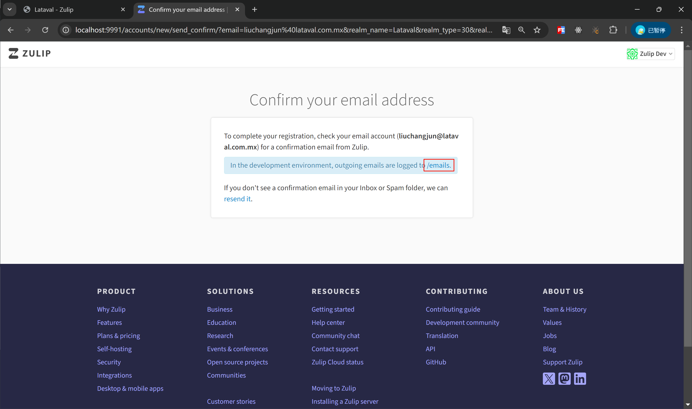
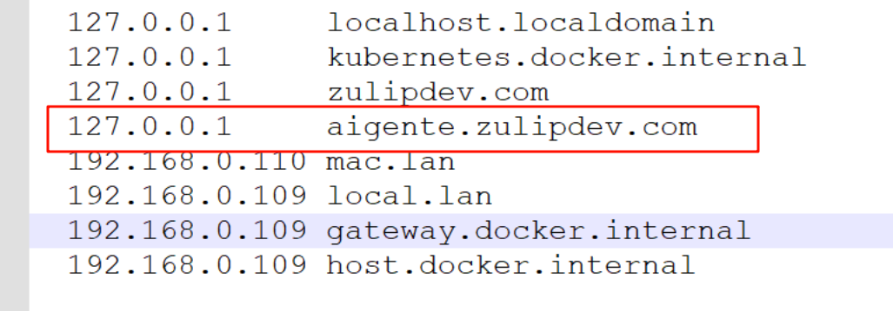
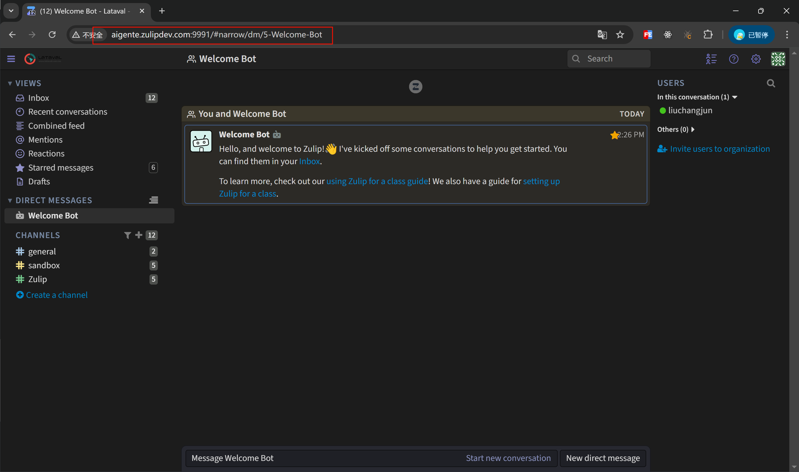
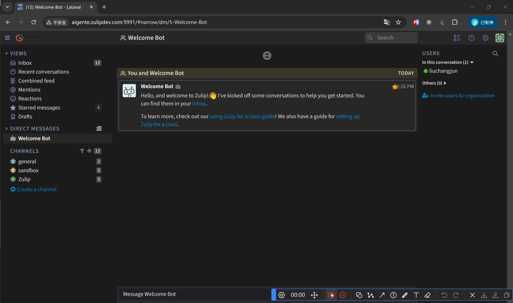

# 项目简介

本项目是客服人员的聊天管理平台。

客户通过AIGente-ChatWidget的聊天窗口发送消息到AIGente-ChatHub服务后。AIGente-ChatHub服务会将消息转发到本项目中。客服人员会收到相应的消息。

本项目还在客服的聊天界面提供了一个按钮用来调用FastGPT提供AI的咨询，以获得AI的帮助。按钮相关代码在
web/templates/message_controls.hbs  13-16行代码
web/src/click_handlers.js  249-277 行代码


# 开发环境配置

## zulip 官方手册

https://zulip.readthedocs.io/en/latest/production/settings.html

本项目的开发需要在 WSL2 中进行远程开发

## Windows 需要安装的软件有

### Docker Desktop	

本机版本：27.2.0

下载地址：`https://desktop.docker.com/win/main/amd64/Docker%20Desktop%20Installer.exe?utm_source=docker&utm_medium=webreferral&utm_campaign=dd-smartbutton&utm_location=module&_gl=1*1eazze9*_gcl_au*ODAxMjE2MzYwLjE3MjUyNzEwODA.*_ga*Njk5MjgyNDA1LjE3MjEzNTU1OTM.*_ga_XJWPQMJYHQ*MTcyOTIzMTUxNi4xMS4xLjE3MjkyMzE1MjEuNTUuMC4w`

### Oracle VirtualBox

本机版本：7.1.2-164945

下载地址：`https://download.virtualbox.org/virtualbox/7.1.4/VirtualBox-7.1.4-165100-Win.exe`

### WSL2


本机版本： 2.0.14.0

现在的windows默认应该都带了这个。我推断是不需要安装的
安装文档：`https://learn.microsoft.com/zh-cn/windows/wsl/install`


### Ubuntu 

本机版本：22.04.5 LTS

安装方式

1. 在 Microsoft Store 中搜索 Ubuntu
2. 找到 Ubuntu 22.04.5 LTS
3. 点击安装
4. 安装完毕之后双击打开即可


## 配置过程

这里是官网中更为详细的配置过程
https://zulip.readthedocs.io/en/latest/development/setup-recommended.html

1. 使用 wsl2 连接 Ubuntu（以下操作都是在 Ubuntu 中执行）

2. 执行命令更新相应软件`sudo apt update && sudo apt upgrade`

3. 执行命令安装相应服务`sudo apt install rabbitmq-server memcached redis-server postgresql`

4. 执行命令编辑文件`sudo nano /etc/rabbitmq/rabbitmq-env.conf`

   ```
   NODE_IP_ADDRESS=127.0.0.1
   NODE_PORT=5672
   ```

5. 执行命令 `cd ~`

6. 克隆仓库代码到本地 https://github.com/VincentDevp/AIGente-Zulip.git

7. 克隆仓库时需要填写账号和密码。账号填写自己的邮箱号。密码填写Github上的令牌

8. 给所有文件添加可执行权限 `chmod -R +x AIGente-Zulip`

9. 进入代码 cd AIGente-Zulip

10. 执行命令开始初始化本地开发环境 `./tools/provision`

11. 切换Python环境`source /srv/zulip-py3-venv/bin/activate`

12. 启动项目`./tools/run-dev`

页面访问地址

 http://localhost:9991/devlogin/

项目启动后会打印一些启动地址，但是并不代表已经启动完毕了。刚开始访问的时候可能会返回一个错误的页面。这时候需要等几分钟才能进行正常的访问。

# 账户密码



这个页面中的账户都是 Zulip 提前内置的，不需要账号和密码，点击就可以进行登录

选择点击后可以进入里面的界面



# 组织创建

访问连接 http://localhost:9991/new




## 组织创建后要激活这个组织，点击弹出页面的 emails



## 激活后会跳转到新的页面

在新的页面中需要配置本地的 host，不然页面将无法访问





## 机器人创建



# 项目开发

项目开发采用的是远程开发的方式，因为代码在WSL中

1. 打开 PyCharm
2. 从File中选择 Remote Development
3. 选择 WSL
4. 点击 New Project 然后等待连接本地的Ubuntu
5. 进入以后选择IDE Version的版本。这里选择 PyCharm 2024.1.6
6. 然后在Project directory中选择项目的路径
7. 点击右下角的Start IDE and Connect
8. 初次时会下载一些文件，需要等待。下载完成以后会自动打开

# Zulip overview

[Zulip](https://zulip.com) is an open-source team collaboration tool with unique
[topic-based threading][why-zulip] that combines the best of email and chat to
make remote work productive and delightful. Fortune 500 companies, [leading open
source projects][rust-case-study], and thousands of other organizations use
Zulip every day. Zulip is the only [modern team chat app][features] that is
designed for both live and asynchronous conversations.

Zulip is built by a distributed community of developers from all around the
world, with 74+ people who have each contributed 100+ commits. With
over 1000 contributors merging over 500 commits a month, Zulip is the
largest and fastest growing open source team chat project.

Come find us on the [development community chat](https://zulip.com/development-community/)!

[](https://github.com/zulip/zulip/actions/workflows/zulip-ci.yml?query=branch%3Amain)
[](https://codecov.io/gh/zulip/zulip)
[][mypy-coverage]
[](https://github.com/astral-sh/ruff)
[](https://github.com/prettier/prettier)
[](https://github.com/zulip/zulip/releases/latest)
[](https://zulip.readthedocs.io/en/latest/)
[](https://chat.zulip.org)
[](https://twitter.com/zulip)
[](https://github.com/sponsors/zulip)

[mypy-coverage]: https://blog.zulip.org/2016/10/13/static-types-in-python-oh-mypy/
[why-zulip]: https://zulip.com/why-zulip/
[rust-case-study]: https://zulip.com/case-studies/rust/
[features]: https://zulip.com/features/

## Getting started

- **Contributing code**. Check out our [guide for new
  contributors](https://zulip.readthedocs.io/en/latest/contributing/contributing.html)
  to get started. We have invested in making Zulip’s code highly
  readable, thoughtfully tested, and easy to modify. Beyond that, we
  have written an extraordinary 150K words of documentation for Zulip
  contributors.

- **Contributing non-code**. [Report an
  issue](https://zulip.readthedocs.io/en/latest/contributing/contributing.html#reporting-issues),
  [translate](https://zulip.readthedocs.io/en/latest/translating/translating.html)
  Zulip into your language, or [give us
  feedback](https://zulip.readthedocs.io/en/latest/contributing/contributing.html#user-feedback).
  We'd love to hear from you, whether you've been using Zulip for years, or are just
  trying it out for the first time.

- **Checking Zulip out**. The best way to see Zulip in action is to drop by the
  [Zulip community server](https://zulip.com/development-community/). We also
  recommend reading about Zulip's [unique
  approach](https://zulip.com/why-zulip/) to organizing conversations.

- **Running a Zulip server**. Self-host Zulip directly on Ubuntu or Debian
  Linux, in [Docker](https://github.com/zulip/docker-zulip), or with prebuilt
  images for [Digital Ocean](https://marketplace.digitalocean.com/apps/zulip) and
  [Render](https://render.com/docs/deploy-zulip).
  Learn more about [self-hosting Zulip](https://zulip.com/self-hosting/).

- **Using Zulip without setting up a server**. Learn about [Zulip
  Cloud](https://zulip.com/plans/) hosting options. Zulip sponsors free [Zulip
  Cloud Standard](https://zulip.com/plans/) for hundreds of worthy
  organizations, including [fellow open-source
  projects](https://zulip.com/for/open-source/).

- **Participating in [outreach
  programs](https://zulip.readthedocs.io/en/latest/contributing/contributing.html#outreach-programs)**
  like [Google Summer of Code](https://developers.google.com/open-source/gsoc/)
  and [Outreachy](https://www.outreachy.org/).

- **Supporting Zulip**. Advocate for your organization to use Zulip, become a
  [sponsor](https://github.com/sponsors/zulip), write a review in the mobile app
  stores, or [help others find
  Zulip](https://zulip.readthedocs.io/en/latest/contributing/contributing.html#help-others-find-zulip).

You may also be interested in reading our [blog](https://blog.zulip.org/), and
following us on [Twitter](https://twitter.com/zulip) and
[LinkedIn](https://www.linkedin.com/company/zulip-project/).

Zulip is distributed under the
[Apache 2.0](https://github.com/zulip/zulip/blob/main/LICENSE) license.
